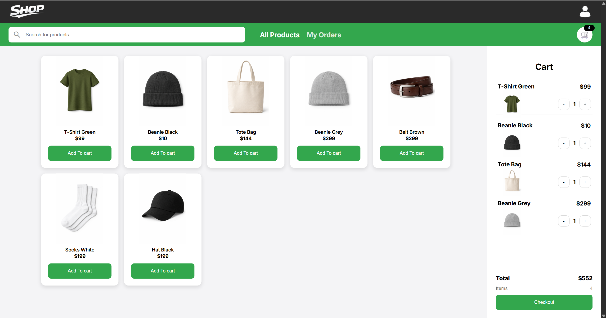
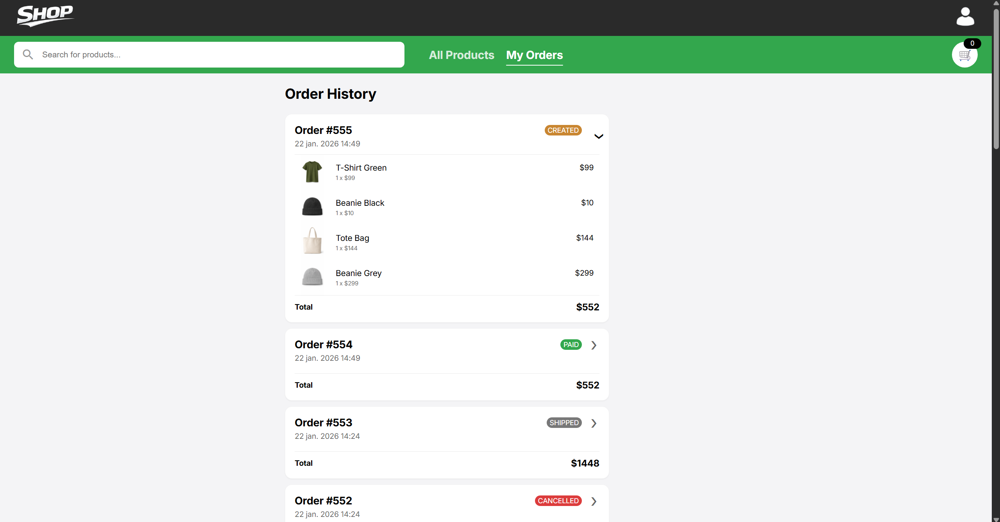
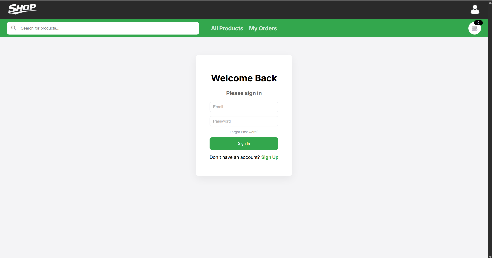

# Shop Frontend

An Angular frontend for a simple shop application, built to work together with the Shop Backend:
https://github.com/emillaudon/shop-backend

This project is built as a learning and portfolio project with a strong focus on clean architecture,
best practices, and maintainable frontend code.

⚠️ This project is still under active development.

---

## Screenshots

### Product Catalog & Shopping Cart

### Order History

### Login Page

---

## Tech Stack

- Angular (standalone components)
- TypeScript
- RxJS
- Angular Router
- ESLint (Angular + TypeScript)
- HTML / SCSS

---

## Features

- Product listing and search
- Shopping cart with reactive state
- Order creation
- Order history with order status (CREATED, PAID, SHIPPED, CANCELLED)
- Feature-based Angular architecture
- Clean separation of UI, data access, and domain logic

---

## Project Structure

src/app  
├─ core/  
├─ features/  
│ ├─ products/  
│ ├─ cart/  
│ └─ orders/  
├─ shared/  
└─ layout/

---

## Code Quality

- ESLint enabled and enforced
- Uses Angular built-in control flow (@if, @for)
- Dependency injection via inject()
- Small, focused components
- Continuous refactoring and cleanup

---

## Running the Project

Install dependencies:

npm install

Start development server:

ng serve

The application will be available at:

http://localhost:4200

Make sure the backend is running for full functionality.

---

## Backend

The backend for this project is implemented in Spring Boot:
https://github.com/emillaudon/shop-backend

---

## Purpose

This project demonstrates:

- Modern Angular development practices
- Clean frontend architecture
- Fullstack communication with a REST API
- Order lifecycle handling

It is intended as a learning and portfolio project.

---

## Status

Work in progress.
New features, refactors, and improvements are added continuously.
